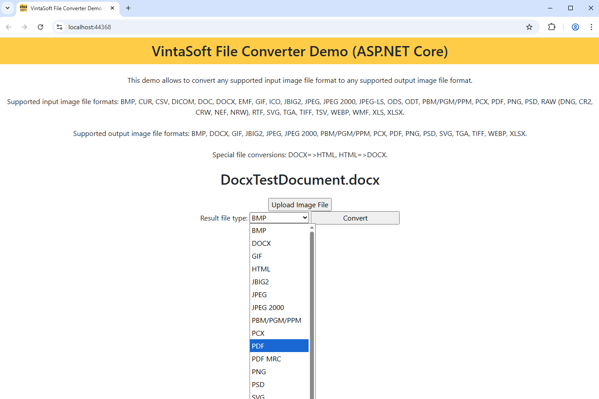

# VintaSoft ASP.NET Core File Converter Demo

This ASP.NET Core project uses <a href="https://www.vintasoft.com/vsimaging-dotnet-index.html">VintaSoft Imaging .NET SDK</a>.
The client-side of project uses HTML+JavaScript+CSS. The server-side of project uses ASP.NET Core API controllers.<br />
<br />
The project demonstrates how to convert images and documents in ASP.NET Core:
* Convert all supported image and document file formats back and forth.
* Progress indicating: image/document loading/encoding, total. 
* Supported input image file formats: BMP, CUR, CSV, DICOM, DOC, DOCX, EMF, GIF, ICO, JBIG2, JPEG, JPEG 2000, JPEG-LS, ODS, ODT, PBM/PGM/PPM, PCX, PDF, PNG, PSD, RAW (DNG, CR2, CRW, NEF, NRW), RTF, SVG, TGA, TIFF, TSV, WEBP, WMF, XLS, XLSX.
* Supported output image file formats: BMP, DOCX, GIF, JBIG2, JPEG, JPEG 2000, PBM/PGM/PPM, PCX, PDF, PNG, PSD, SVG, TGA, TIFF, WEBP, XLSX.
* Special file conversions: DOCX=>HTML, HTML=>DOCX.


## Screenshot
<br />


## Usage
1. Get the 30 day free evaluation license for <a href="https://www.vintasoft.com/vsimaging-dotnet-index.html" target="_blank">VintaSoft Imaging .NET SDK</a> as described here: <a href="https://www.vintasoft.com/docs/vsimaging-dotnet/Licensing-Evaluation.html" target="_blank">https://www.vintasoft.com/docs/vsimaging-dotnet/Licensing-Evaluation.html</a>

2. Update the evaluation license in "src\Program.cs" file:
   ```
   Vintasoft.Imaging.ImagingGlobalSettings.Register("REG_USER", "REG_EMAIL", "EXPIRATION_DATE", "REG_CODE");
   ```

3. Build the project ("AspNetCoreFileConverterDemo.Net10.csproj" file) in Visual Studio or using .NET CLI:
   ```
   dotnet build AspNetCoreFileConverterDemo.Net10.csproj
   ```

4. Run compiled application and try to convert images and documents.


## Documentation
VintaSoft Imaging .NET SDK on-line User Guide and API Reference for Web developer is available here: https://www.vintasoft.com/docs/vsimaging-dotnet-web/


## Support
Please visit our <a href="https://myaccount.vintasoft.com/">online support center</a> if you have any question or problem.
